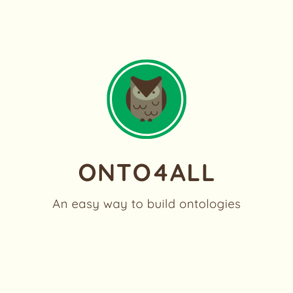

<p align="center">
 
 </p>
 <h3 align="center">
 OntoForALL é um editor gráfico com a capacidade de criar, editar e exportar ontologias para XML, OWL, SVG. Disponível em:
 <a href="https://onto4alleditor.com/">https://onto4alleditor.com/</a>
 </h3>
 
 


 
## Documentação 
* Ferramenta 1: Laravel 6.x+ / https://laravel.com/docs/6.x
* Ferramenta 2: AdminLTE / https://adminlte.io/themes/AdminLTE/pages/UI/general.html
* Ferramenta 3: mxGraph / https://jgraph.github.io/mxgraph/ 

### Guia de instalaçao 
#### Pré-requisitos 
* PHP: * Versão >= 7.1.3
* OpenSSL PHP Extension 
* PDO PHP Extension 
* Mbstring PHP Extension 
* Tokenizer PHP Extension 
* XML PHP Extension 
* Ctype PHP Extension 
* JSON PHP Extension + Banco de dados (MySQL, SQLite) + Servidor web (Apache)
* Composer. 
* Docker Desktop 

##### Passo a passo 

1. Clone o repositório para seu computador; 

2. Execute o Docker Desktop

3. Dentro da pasta principal do projeto, execute o comando **docker-compose up --build** 

4. Verifique se as imagens do PHP, Apache e database estão rodando corretamente.

5. Configure o arquivo **.env** com as configurações do banco de dados local; 

**Exemplo:**

````

DB_DATABASE=nome_do_seu_banco_de_dados

DB_USERNAME=seu_username

DB_PASSWORD=sua_password

````

6. Para executar o projeto, use o comando: **php artisan serve**;

7. Acesse a URL indicada no terminal;

#### Desenvolvimento 

* OntoForAll usa a biblioteca de Javascript mxGraph como componente principal para diagramação das ontologias, com o GraphEditor Example como base para tudo. O restante do projeto foi desenvolvido utilizando Laravel. O frontend foi feito utilizando o template AdminLTE2 como base.


#### Desenvolvido por Lucas Piazzi de Castro ####
